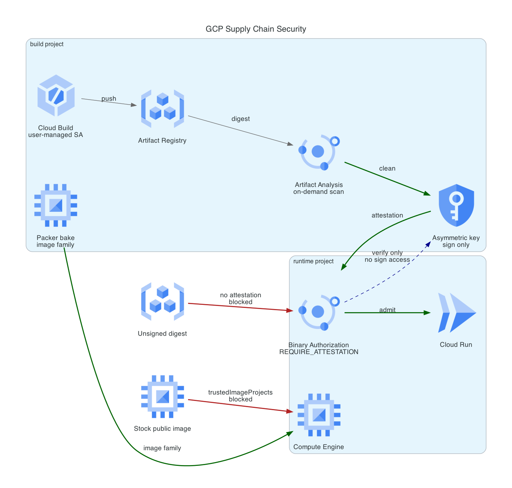

# GCP Supply Chain Security

A signature, not a naming convention. Packer bakes a hardened VM image that a GCP org policy makes the only bootable one, Cloud Build scans a container and signs the digest only if the scan comes back clean, and Binary Authorization on Cloud Run refuses to start anything that digest signature does not cover.

The demo is two refusals. An image that is real, in the right registry, built by the right Cloud Build, under a plausible tag, and unsigned, gets rejected at deploy. A stock public VM image gets rejected at instance create. Then the same source goes through the pipeline and runs.



**Cost:** under $1 for a full build, demo, and destroy cycle. The standing cost if left up is about $0.10 per month, almost all of it one KMS key version. **Teardown:** four things `terraform destroy` does not clean, all documented below, all handled by `scripts/destroy.sh`.

## The problem

Most artifact controls check the wrong thing. They check where an image came from: this registry, that repository path, a tag matching a pattern. Every one of those is a string, and every one of them is satisfied by an attacker who can push to the registry, which is a much lower bar than compromising a build.

The question worth answering is not "did this come from the right place" but "did the checks actually run on these exact bytes". That is a question about a specific digest, and the only durable answer is a signature over it, made by something that could not have signed unless the checks passed.

The same argument applies one layer down. A golden VM image is not a control. Baking a hardened image and then leaving stock images bootable next to it means the hardening applies to the instances that opted into it, which is the instances that were not the problem.

## How GCP differs from AWS and Azure here

This is the third version of this idea, after an AWS pipeline and the Azure Policy version. The differences are the reason it was worth building a third time.

**The check is cryptographic, not nominal.** The Azure equivalent uses Azure Policy to require that container images come from an approved registry, which is a string match on the image reference. Binary Authorization evaluates a signature over the digest. An attacker who can push to the approved registry defeats the first and gets nowhere against the second, because pushing does not grant access to the signing key.

**Enforcement is at admission, in the platform, not in the pipeline.** A pipeline that refuses to deploy an unsigned image protects you from the pipeline. Binary Authorization sits in the Cloud Run and GKE admission path, so it also refuses a deploy typed by hand at a terminal, and there is no way to reach the runtime that routes around it.

**Image trust is expressed as a project, not a name.** `compute.trustedImageProjects` takes a list of projects whose images may be booted. AWS has no direct equivalent: restricting AMIs means an IAM condition on `ec2:RunInstances` matching AMI owner or tags, which is a policy you write and can get wrong. On GCP the unit of trust is the container the images live in, so there is no naming rule to work around and nothing to tag correctly.

**Attestation identity is a Cloud KMS key, so the split is enforceable.** The signing key lives in the build project and the deployment policy lives in the runtime project. The runtime project's Binary Authorization service agent gets `attestorsVerifier`, which reads the public half, and nothing more. Verifying and signing are different permissions on different resources in different projects, so bypassing the gate means compromising both.

## What gets built

Two projects, split on the boundary the control runs across.

**Build project.** Artifact Registry, Cloud Build running as a dedicated service account, Artifact Analysis, a Cloud KMS asymmetric signing key, the Container Analysis note, and the attestor. Also where Packer bakes.

**Runtime project.** The Binary Authorization policy, Cloud Run, a minimal VPC, and the `compute.trustedImageProjects` constraint. No signing key, and no path to one.

If the signing key lived in the same project as the deployment policy, anyone who could edit the policy could also mint the signature that satisfies it, and the whole thing would degrade into a label.

### Card 02, the golden image

Packer boots a stock Canonical image in the build project, applies a CIS-informed hardening pass, verifies the hardening took, and publishes into an image family. A second provisioner runs the verification separately from the hardening, because a script that both applies and checks its own work tends to check the variable it just set.

The hardening is deliberately not a full CIS Level 2 run. Applied wholesale to a cloud base image, a benchmark breaks the guest environment agent or the OS Login PAM stack, and the failure shows up as instances that boot and cannot be logged into. What is in `packer/scripts/harden.sh` is the subset that survives contact with GCE: patching plus unattended security upgrades, SSH restrictions, kernel and network sysctls, filesystem modules blocked, audit rules on the files that decide who is who, AppArmor enforcing, and Shielded VM with Secure Boot, vTPM, and integrity monitoring.

The bake also removes the SSH host keys and truncates the machine ID, so every instance from the family generates its own on first boot. An image that ships one host key to a whole fleet defeats host verification for the entire fleet.

Enforcement is `compute.trustedImageProjects`, scoped to the runtime project with the build project as the only allowed value. It is scoped to the project rather than the organization because at the org it would also cover the build project, where Packer has to boot a stock image in order to harden it, and the bake would deadlock on the policy it exists to satisfy.

### Card 03, the Terraform gate

`platform-guardrails` supplies the static half through `tf-ci.yml@v1`: fmt, validate, tflint, Checkov, Trivy config, conftest, and a gitleaks pass over full history. That runs on every pull request, credential-free, for both the root module and the bootstrap layer.

The plan-level gate is in this repo as `.github/workflows/terraform-vet.yml`, because the guardrails `tf-plan.yml` OIDC step is AWS-shaped and forcing GCP into it would put two clouds' auth paths in a shared workflow. It authenticates through Workload Identity Federation, never a service account key, and runs `gcloud beta terraform vet` against the plan JSON with the three constraints in `policy-library/constraints/`.

The shared conftest suite in `platform-guardrails` is AWS-shaped by history, so on a GCP repo its rules pass by being vacuously true. `policy/gcp.rego` adds the equivalents that do apply: no default VPC, uniform bucket-level access, no basic role grants, no service account keys, and a rule that fails a Binary Authorization policy set to `ALWAYS_ALLOW`, which is the setting that makes the resource exist while enforcing nothing.

Vetting the plan rather than the HCL is the point. Conftest and Checkov read source, so they cannot see inside a module or resolve a computed value, which means an HCL-level policy is blind to exactly the resources a module-based repo creates. The plan has already resolved all of it.

The job is inert until `GCP_WIF_PROVIDER` is set as a repository variable, so a fork or a torn-down environment does not fail red for no reason.

### Card 04, the signed artifact

`app/cloudbuild.yaml` builds the container, pushes it, resolves the tag to a digest, and works on the digest from then on. Then:

**Scan.** On-demand scanning rather than the automatic Artifact Registry scan, and the reason is timing. Automatic scanning is asynchronous: the push returns, the occurrence appears some seconds or minutes later, and a pipeline gating on it has to poll and guess how long "not found yet" means "clean". On-demand scanning is synchronous, so a clean result is a result rather than the absence of one.

**Sign.** `scripts/attest.sh` refuses to sign anything that is not a digest. A tag can be moved to point somewhere else after the signature is made, so an attestation over a tag says nothing about what runs.

**Deploy.** `gcloud run deploy --binary-authorization=default`, at which point the runtime project's policy decides.

The gate is the step ordering, not a conditional. Cloud Build stops on the first failing step, so `attest` is unreachable when `scan` exits non-zero, and there is nothing in the signing step to bypass.

The default blocking severity is CRITICAL only. HIGH is the right setting once the base image is pinned and patched, and the wrong one before that, because the gate then fails on findings in distro packages the build does not control and gets switched off within a week. The container is a static Go binary on `distroless/static`, which keeps the scan result about the code rather than about Debian's release cadence. That held up: when the gate did fire, it fired on the Go toolchain, not on a distro package.

Cloud Build runs as a dedicated service account, not the legacy default. That default carries `roles/editor` on its own project, which would let a compromised build step rewrite the policy meant to constrain it.

## Deploy

Requires an organization, an open billing account, Terraform, Packer, and gcloud. Roles needed:

| Role | Needed for |
|---|---|
| `resourcemanager.projectCreator` | Creating the seed, build, and runtime projects |
| `billing.user` or `billing.admin` | Linking projects to the billing account |
| `orgpolicy.policyAdmin` | Setting `compute.trustedImageProjects` on the runtime project |
| `resourcemanager.projectIamAdmin` | The cross-project grants between build and runtime |

```bash
# 1. Seed project and state bucket
cd bootstrap
cp terraform.tfvars.example terraform.tfvars   # fill in org_id, billing_account
terraform init && terraform apply

# 2. Root module
cd ../terraform
terraform output -state=../bootstrap/terraform.tfstate -raw backend_hcl > backend.hcl
cp terraform.tfvars.example terraform.tfvars   # fill in, including seed_project_id
terraform init -backend-config=backend.hcl
terraform apply

# 3. Environment for the pipeline and the demo
cd ..
./scripts/demo.sh env
source .demo.env

# 4. Bake the golden image
cd packer
packer init .
packer build -var project_id="${BUILD_PROJECT}" -var zone="${ZONE}" hardened-image.pkr.hcl
```

The root module needs two apply passes on a first run. The provider expands the plan for `google_binary_authorization_policy` before the attestor it references exists, and fails with "Provider produced inconsistent final plan". The second apply succeeds because the attestor ID is known by then, and everything created on the first pass is kept.

## Validation

```bash
./scripts/demo.sh all
```

Four acts, each runnable on its own:

| Act | Command | What passing looks like |
|---|---|---|
| 1 | `demo.sh blocked` | Unsigned image pushed to the trusted registry, `gcloud run deploy` refused by Binary Authorization |
| 2 | `demo.sh allowed` | Same source through the pipeline, scanned, signed, deployed, and answering on its URL |
| 3a | `demo.sh images` | Instance create from `debian-cloud` refused by `compute.trustedImageProjects` |
| 3b | `demo.sh images` | Instance create from the hardened family succeeds |

Two of the four expect a non-zero exit, so the script checks that the failure was the predicted one. A deploy that fails for an unrelated reason is reported as a failed demo rather than as a passing control, which matters more than it sounds: a broken image, a missing permission, and an enforced policy all produce a failed deploy, and only one of them is the thing being demonstrated.

The service is deployed `--no-allow-unauthenticated`, so act 2 calls it with an identity token. That is deliberate rather than an oversight, and it lines up with the `iam.allowedPolicyMemberDomains` constraint in `gcp-landing-zone`.

## What the live run found

Everything below was found by deploying this for real on 2026-08-10, not by reading documentation. They are recorded because each one cost time and none of them is in the obvious place.

**The Terraform provider drops `require_attestations_by` on update.** Changing the attestor list on an existing `google_binary_authorization_policy` sends the wrong value: going from two attestors to one sent an empty list, which the API rejected with "evaluation mode requires at least one require_attestations_by", and going from one to two sent one, alternating which survived. Importing the identical policy with `gcloud container binauthz policy import` works, so the defect is on the provider's write path rather than in Binary Authorization. The remedy is `terraform apply -replace=google_binary_authorization_policy.runtime`, because the create path is fine and only the update path is broken.

**A build cannot satisfy `built-by-cloud-build` for its own deployment.** The provenance attestation is written when the build completes, so at the moment the deploy step runs it does not exist yet. Requiring that attestor means splitting build and deploy into separate pipelines. See `require_cloud_build_attestation`.

**Attaching an attestation and reading one back are different permissions.** The build signs, then polls until the attestation is readable before deploying. With only `containeranalysis.notes.attacher`, that poll returns an empty list forever: the call succeeds and returns nothing, so it looks like a propagation delay that never resolves. The fix is `containeranalysis.notes.occurrences.viewer` on the note, after which the attestation is visible in about one second.

**The seed project needs every API Terraform calls, not just the ones it owns.** `user_project_override` with `billing_project` pointed at the seed makes the seed the quota project for every call, and Google requires an API to be enabled on the quota project as well as on the project the resource lands in. Creating a key ring in the build project fails with `SERVICE_DISABLED` naming the seed, which is a project you are not creating anything in.

**A stale ADC quota project reads as a missing bucket.** `terraform init` failed with "bucket doesn't exist" for a bucket that plainly existed. The cause was `gcloud auth application-default` still pointing its quota project at a seed project deleted by an earlier build, so the storage call billed to a dead project. Fixed with `gcloud auth application-default set-quota-project`.

**The image verification gate caught a conflict between two of its own steps.** The first bake failed on "sshd config parses", because `sshd -t` needs a host key and the cleanup step had already deleted the host keys so that every instance generates its own. That is the gate working: it refused to publish an image whose config had not been parsed. `verify.sh` now generates a throwaway key for the check.

**The scan gate blocked our own container.** The first pipeline run was refused with two CRITICALs, both in the Go toolchain rather than in the application or the base image, fixed in 1.24.13 and 1.25.9. The build was on 1.23.12. Bumping the builder to 1.25 was the correct response, and lowering the threshold would have been the tempting one. This is the argument for CRITICAL-only as a starting point: the gate fired once, on something real, and was actionable in one line.

## Teardown

`terraform destroy` does not fully clean this build. Four gaps, each a property of GCP rather than a bug in the config:

**Packer images are outside Terraform state.** Packer publishes them through the Compute API, so destroy has never heard of them and leaves the whole family standing.

**A KMS key cannot be deleted.** Versions can only be scheduled for destruction, with a 24 hour minimum. Destroy drops the key from state and leaves it in place, which is why this build costs a few cents after teardown rather than nothing.

**The Binary Authorization policy is a per-project singleton.** There is no delete, only a reset to the default, and the default is permissive. Destroy therefore leaves a surviving project accepting anything, which is the opposite of what a clean teardown should mean.

**Cloud Run services created by the pipeline are not in state either,** and a running service holds a lease on the registry it pulls from.

Deleting the projects resolves all four at once, which is why that is the last step:

```bash
./scripts/destroy.sh
```

It deletes pipeline-created services, demo instances, Packer images, and container images, schedules the KMS key versions for destruction, runs `terraform destroy`, then reports each project's lifecycle state. `DELETE_REQUESTED` is the expected result. GCP purges after 30 days, and until it does the project still counts against the billing account's project quota, which is worth knowing before starting the next build rather than during it.

The seed project and state bucket are left standing on purpose so the state history survives. Remove them with `terraform -chdir=bootstrap destroy` after setting `force_destroy_state = true`.

## Cost

| Resource | Cost |
|---|---|
| KMS asymmetric key version, SOFTWARE | ~$0.06 per month, plus a fraction of a cent per signature |
| Artifact Registry storage | Pennies at this size, under the 0.5 GB free tier |
| On-demand vulnerability scans | ~$0.26 per image scanned |
| Cloud Build | Free tier covers a build this size |
| Cloud Run | Scales to zero, so nothing between demos |
| Packer bake instance | One `e2-small` for about five minutes |
| Demo instances | Two `e2-micro`, deleted immediately |

`kms_protection_level` defaults to SOFTWARE rather than HSM. The threat this build addresses is an unreviewed image reaching production, not key extraction from a Google datacenter, and HSM is roughly twenty-five times the price for a key version while changing nothing about the control being demonstrated.

## Repository layout

```
bootstrap/            Seed project and state bucket
terraform/            Build and runtime projects, registry, KMS, attestor, policy
packer/               Golden image template and hardening scripts
app/                  Go service, Dockerfile, and both Cloud Build configs
policy/               Repo-local Rego, layered on the shared conftest suite
policy-library/       CFT constraints for gcloud beta terraform vet
scripts/              Scan gate, attestation, demo, teardown
.github/workflows/    Guardrails, app CI, terraform vet
```

## What this does not do

**No GitHub trigger.** A Cloud Build trigger needs a console OAuth handshake that cannot be expressed in Terraform. The pipeline is driven by `gcloud builds submit` instead, which keeps a manual click out of a repo whose claim is that the path from source to production is mechanical.

**No SBOM.** Cloud Build can emit one, and the honest version of this build would store it alongside the attestation and gate on its contents. The scan gate answers "are there known criticals in this digest", not "what is in this digest", and those are different questions.

**One attestor doing one job.** The design is set up for more: a second claim gets its own note, its own key, and its own line in `require_attestations_by`. Code review approval and integration test results are the obvious next two.

**Nothing continuously validates what is already running.** Binary Authorization checks at admission. A vulnerability disclosed the day after a deploy does not stop the running revision, and closing that gap means continuous validation and re-attestation on a schedule.
